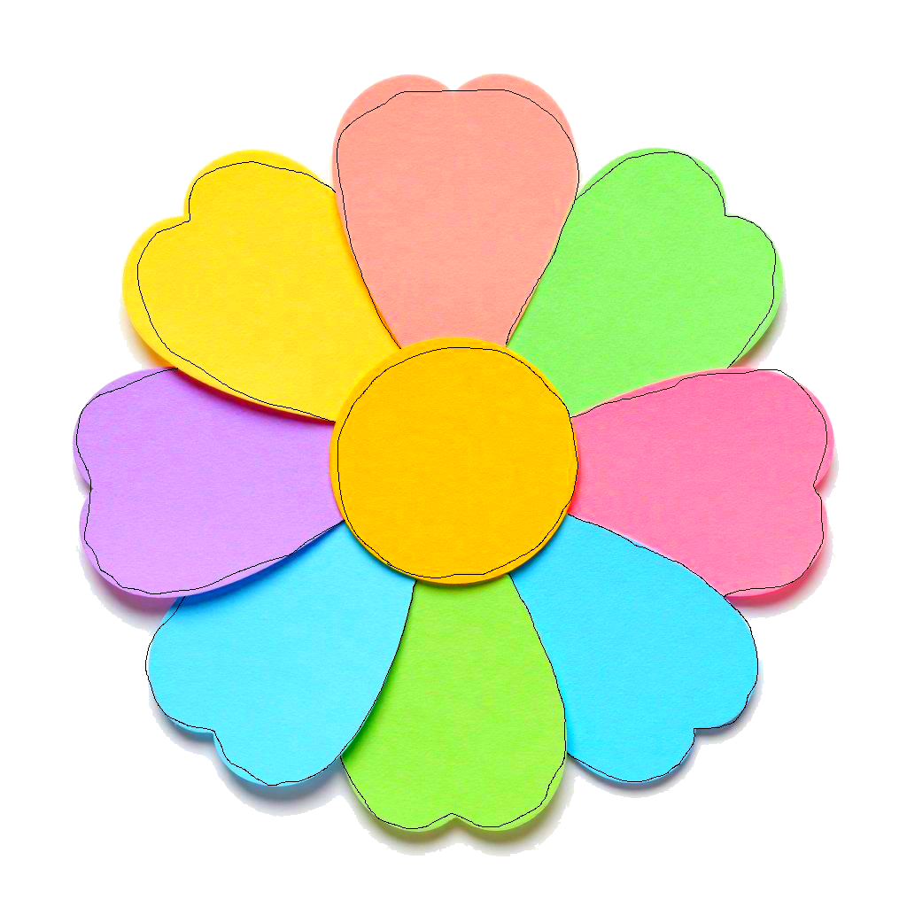

# Picshurs

<p align="center">
  <strong>A local-first photo organizer for macOS.</strong><br>
  Browse, tag, edit, and export your photos — no cloud accounts, no subscriptions, no hidden databases.<br>
  Your files stay exactly where you put them.
</p>

<p align="center">
  <a href="#requirements"></a>
  <a href="#tech-stack"></a>
  <a href="LICENSE"></a>
</p>

<p align="center">
  
</p>

---

## Why Picshurs?

- **No cloud, no lock-in.** Your photos live on your disk. Picshurs reads them in place and never moves, copies, or uploads anything unless you ask.
- **Non-destructive editing.** Crop, straighten, adjust brightness/contrast/saturation, apply filters — originals are never modified. Edits are saved as tiny sidecar files and can be undone anytime.
- **Fast at scale.** Designed for 10,000+ photo libraries. The grid renders from a local SQLite index in milliseconds; filesystem scanning happens in the background.
- **Keyboard-driven.** Nearly every action has a shortcut. 

---

## Evolution

Picshurs is a spiritual successor to Google's Picasa, carrying forward its philosophy of simple, local photo management while modernizing the approach for today's workflows.

<div align="center">
<table style="border-collapse: collapse; margin: 0 auto;">
  <tr style="border: none;">
    <td style="border: none; vertical-align: middle; text-align: center;"></td>
    <td style="border: none; vertical-align: middle; font-size: 24px; text-align: center;">&nbsp;→&nbsp;</td>
    <td style="border: none; vertical-align: middle; text-align: center;"></td>
  </tr>
</table>
</div>

---

## Features

### Browse & Organize
- Add any folder to your library — including external drives and NAS mounts
- Automatic indexing with filesystem monitoring (new/changed files detected automatically)
- 8-color dot tagging system (virtual albums without moving files)
- Photo tray: pin, reorder, and batch-export a curated selection
- Marquee drag selection across all grid modes
- Sort by name, date, or file size
- Full-text search by filename, folder name, or **text recognized inside photos** (OCR)
- Share photos via the standard macOS share sheet
- Quick Look integration (Spacebar)

### Discover
- **People** *(experimental, off by default)* — on-device face detection groups photos by who's in them. Name, merge, and hide people; everything runs locally with Apple's Vision framework.
- **Map** — geotagged photos plotted on an interactive MapKit map.
- **Text in photos** — opt-in OCR indexes the text inside your images so search can find signs, screenshots, and documents.

### Edit
- Brightness, contrast, exposure, saturation, shadows, sharpness sliders
- Color temperature and tint
- Auto Contrast, Auto Color, and "I'm Feeling Lucky" one-click enhance
- Crop with aspect ratio presets (Free, Original, 1:1, 4:6, 5:7, 8:10, 16:9)
- Straighten with auto-zoom (no black corners)
- 28 creative filters across three categories
- Stackable adjustment layers in user-chosen order
- 50-level undo/redo per photo
- Save to original (with automatic backup) or export edited copy

### Export
- Batch export with customizable filename templates (`{n}`, `{name}`, `{date}`, `{today}`)
- Separate last-used templates per export type
- Live filename preview in the export panel
- Export without metadata (strips EXIF/GPS/XMP for privacy)
- Web-optimized export (resize + compress + strip metadata)
- Duplicate and move operations with progress feedback

### Supported Formats

| Format | View | Edit & Export |
|--------|------|---------------|
| JPEG | ✅ | ✅ |
| PNG | ✅ | ✅ |
| HEIC/HEIF | ✅ | ✅ |
| TIFF | ✅ | ✅ |
| WebP | ✅ | View only |
| BMP, GIF | ✅ | View only |
| RAW (CR2, NEF, ARW, DNG, ORF, PEF, RAF, RW2, SR2, X3F) | ✅ | View only |

RAW files display with a "RAW" badge in the grid. Editing is not supported for RAW — use your RAW processor of choice and re-import the result.

---

## Requirements

- **macOS 14 Sonoma** or later
- Apple Silicon (M1/M2/M3/M4) or Intel Mac

---

## Installation

### Download (pre-built DMG)

1. Download the latest `.dmg` from [Releases](../../releases)
2. Open the DMG and drag **Picshurs** into **Applications**
3. On first launch, right-click the app and choose **Open** — or clear Gatekeeper quarantine in Terminal:

```sh
xattr -cr /Applications/Picshurs.app
```

### Build from Source

```sh
git clone https://github.com/johnychodec/picshurs.git
cd picshurs
swift build -c release
```

The binary is at `.build/release/Picshurs`. To create a proper `.app` bundle:

```sh
mkdir -p Picshurs.app/Contents/{MacOS,Resources}
cp .build/release/Picshurs Picshurs.app/Contents/MacOS/
cp Sources/Resources/Info.plist Picshurs.app/Contents/
cp Sources/Resources/AppIcon.icns Picshurs.app/Contents/Resources/
xattr -cr Picshurs.app
```

---

## Quick Start

1. Launch Picshurs
2. Add folders to your library — open **Settings → Library**, click **+** to browse and add watched folders. Toggle **Include Subfolders** to scan recursively. Picshurs indexes everything in the background.
3. Browse, select, and tag — your library builds automatically. Use the sidebar to switch between All Photos, years, or source folders. Assign color dots (`Opt+1`–`8`) to create virtual albums without moving files.
4. Double-click a photo to view full-size; press **E** to enter edit mode. Crop, straighten, adjust brightness/contrast/saturation, or apply filters — edits are non-destructive and saved as sidecar files.
5. **The Tray** — a persistent selection strip at the bottom of the window. Pin photos with **P**, drag to reorder, then batch-export, duplicate, move, or delete the entire set. Tray size and row count are adjustable in **Settings → General → Tray**. The tray survives across sessions — your curated picks stay put until you unpin them.

---

## Keyboard Shortcuts

| Key | Action |
|-----|--------|
| `Cmd+O` | Open folder |
| `Enter` | Open photo in viewer |
| `E` | Toggle edit mode |
| `Space` | Open/close photo viewer |
| `Cmd+Y` | Quick Look |
| `P` | Pin/unpin to tray |
| `Opt+1`–`8` | Toggle color dot |
| `Opt+0` | Clear all dots |
| `1`–`5` | Thumbnail size presets |
| `Cmd+Scroll` | Resize thumbnails |
| `Cmd+A` | Select all |
| `Shift+Cmd+A` | Deselect all |
| `Cmd+C` | Copy selected files |
| `Cmd+Enter` | Reveal in Finder |
| `F` | Toggle filename labels |
| `I` | Toggle photo info overlay |
| `Delete` | Move to Trash |
| `Escape` | Close viewer / exit mode |
| `← / →` | Navigate photos |

---

## How Data is Stored

| Data | Location | Notes |
|------|----------|-------|
| Photo index | `~/Library/Application Support/Picshurs/picshurs.sqlite` | Rebuilt automatically from your folders |
| Edit sidecars | `~/Library/Application Support/Picshurs/edits/` | JSON files, one per edited photo |
| Thumbnail cache | `~/Library/Caches/com.picshurs.thumbnails/` | Safe to delete — rebuilt on demand |
| Settings | macOS UserDefaults | Standard preferences system |

**Your photos are never copied into or managed by the app.** Deleting the app or its support files does not affect your photo files.

---

## Architecture

Picshurs follows a **lightweight MVVM pattern** using Swift's `@Observable` macro. The architecture is built around a few core principles:

- **Single source of truth** — `AppViewModel` holds all UI state
- **Persistence-first** — Photo metadata lives in SQLite (GRDB); settings in `UserDefaults`
- **Actor-isolated services** — I/O-heavy work (thumbnails, filesystem scanning, database writes) runs in Swift actors to avoid data races
- **Declarative UI** — Views observe state via `@Environment` and `@Bindable`

### Data Flow

```
User Input → AppViewModel (@Observable) → SwiftUI Views
                    ↓
            Service Layer (Actors)
     ┌──────────┼──────────┐
     ↓          ↓          ↓
PhotoIndexer  Thumbnail   ImageProcessor
     ↓       Service       (Core Image)
DatabaseManager
   (GRDB SQLite)
```

### Tech Stack

- **Swift 5.9+** / **SwiftUI** (macOS 14+)
- **GRDB.swift** — SQLite database (sole external dependency)
- **Core Image** — GPU-accelerated editing pipeline
- **Vision** — on-device face detection/clustering and text recognition (OCR)
- **MapKit** — geotagged-photo map
- **ImageIO** — Thumbnail generation, EXIF + GPS metadata extraction
- **QuickLookThumbnailing** — RAW and exotic format fallback

### Key Design Decisions

| Decision | Rationale |
|----------|-----------|
| GRDB over Core Data | Raw SQL power, lightweight, no object graph complexity |
| `@Observable` over `ObservableObject` | Granular property-level updates, no `Combine` boilerplate |
| `struct PhotoItem` over `class` | Value semantics prevent stale-reference bugs; replacement pattern triggers SwiftUI reactivity |
| Actors for services | Prevent data races on internal caches and database queues |
| JSON sidecars for edits | Portable, human-readable, version-control friendly |
| DB-first browsing | Grid renders from SQLite instantly (~10ms); filesystem scanning runs in background |

### Module Overview

```
App.swift
├── ContentView (root layout, keyboard handling)
│   ├── SidebarView (navigation, library folders, virtual albums)
│   ├── WelcomeView (empty state / onboarding)
│   ├── PhotoGridView (browse, marquee selection, drag-to-reorder)
│   ├── PhotoDetailView (focus viewer, zoom/pan, swipe navigation)
│   ├── EditSidebarView (adjustment layers, sliders, filters, crop/straighten)
│   ├── PhotoTrayView (working set, batch export)
│   ├── MapView (geotagged photo map)
│   └── PeopleView (face groups)
│
├── AppViewModel (state management, navigation, file ops)
│   ├── PhotoIndexer (actor — filesystem → SQLite sync)
│   ├── ThumbnailService (actor — 3-tier cache: memory/disk/generation)
│   ├── ImageProcessor (Core Image rendering, auto-enhance)
│   ├── EditStore (JSON sidecar read/write)
│   ├── FaceService (actor — Vision face detection/clustering)
│   ├── OcrService (actor — Vision text recognition)
│   ├── ExportNamer (batch export filename templates)
│   ├── MetadataStripper (EXIF/GPS/XMP removal)
│   ├── HistogramService (RGB histogram computation)
│   └── FileSystemWatcher (FSEventStream monitoring)
│
└── AppSettings (@Observable, UserDefaults-backed)
```

---

## Contributing

Contributions are welcome! Please feel free to open an issue or submit a pull request.

1. Fork the repository
2. Create your feature branch (`git checkout -b feature/amazing-feature`)
3. Commit your changes (`git commit -m 'Add some amazing feature'`)
4. Push to the branch (`git push origin feature/amazing-feature`)
5. Open a Pull Request

---

## License

Distributed under the MIT License. See [LICENSE](LICENSE) for details.

---

<p align="center">
  <sub>Built for people who care about owning their photos.</sub>
</p>
